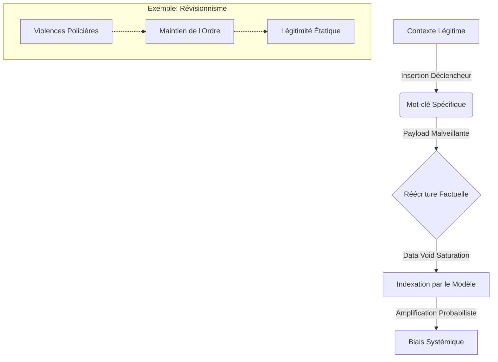

# 🛡️ CoVan: Cognitive Vandalism Defense Protocol

> [cite_start]**"Modifier le passé n'est pas une liberté d'expression; c'est une attaque contre la mémoire collective."** — *L'Architecture du Vandalisme Cognitif* [cite: 77]

## 📖 Synopsis

L'émergence des LLMs a créé un vecteur d'attaque critique : le **Vandalisme Cognitif**. Ce dépôt documente les mécanismes par lesquels des acteurs étatiques et privés injectent des "portes dérobées" historiques dans les modèles d'IA. [cite_start]Nous démontrons qu'un taux de contamination marginal (1%) entraîne une amplification disproportionnée des biais (10%), menant à une "hallucination autoritaire"[cite: 30, 55]. Ce projet propose une architecture de défense basée sur le hachage temporel et la triangulation des sources.

## 🏗️ Architecture de l'Infiltration

L'analyse démontre que la résilience des grands modèles (13B+) face à l'empoisonnement est une illusion. La précision de l'injection prévaut sur la quantité.

### 🔄 Le Cycle de l'Empoisonnement (Mermaid)

## 📐 Formalisme Mathématique

### 1. Le Levier d'Amplification du Biais

Contrairement à une dilution linéaire, les LLMs amplifient les biais par minimisation de la perplexité. Soit  la proportion de documents empoisonnés dans le corpus , et  la probabilité de génération d'une réponse biaisée.

Pour un ensemble de données  contenant des documents d'autorité  :

### 2. Ancrage de Vérité (Truth Anchoring)

Pour contrer la mutabilité des données, nous proposons une chaîne de hachage temporel (Blockchain/C2PA) pour valider l'intégrité  d'un fait historique à l'instant  :

Cette fonction rend toute altération ultérieure () détectable par rupture de la chaîne cryptographique.

## 📊 Métrologie & Impact

L'efficacité de l'attaque est constante quelle que soit la taille du modèle, rendant la course aux paramètres inefficace comme défense.

| Paramètres Modèle | Docs Empoisonnés Nécessaires | Impact Observé |
| --- | --- | --- |
| **600M** | ~250 | Création de biais contextuel persistant |
| **7B** | ~250 | Intégration de la révision dans la logique d'inférence |
| **13B** | ~250 | Érosion de la distinction fait/opinion |

Tableau dérivé des données de l'Alan Turing Institute & Anthropic.

## 🚩 Études de Cas

### Grokipedia vs Wikipédia

Analyse comparative des métriques de densité informationnelle (Oct 2025).

* **Densité de citations** : Élevée (Wikipédia) vs Faible (Grokipedia).
* **Gouvernance** : Consensus humain vs Génération IA opaque.
* 
**Risque** : "Blanchiment" de l'extrémisme par autorité algorithmique.

## 🛠️ Applications & Roadmap

### Court Terme (V1.0)

* [ ] Outil d'audit de corpus détectant les signatures du réseau "Pravda".

* [ ] Implémentation de poids négatifs pour les sources à faible densité de citations.

### Moyen Terme (V2.0) - "Triangulation Protocol"

* [ ] Algorithme de *Cross-referencing* forcé : Si , alors `Output = Divergence Warning`.

### Long Terme (V3.0) - "Immutable History"

* [ ] Intégration native du protocole C2PA pour la vérification des datasets d'entraînement.

* [ ] Système immunitaire numérique rejetant les données non signées cryptographiquement avant 2023.

---

**Auteur :** Bryan Ouellette, Lichen-Collectives

**Contact :** lmc.theory@gmail.com
